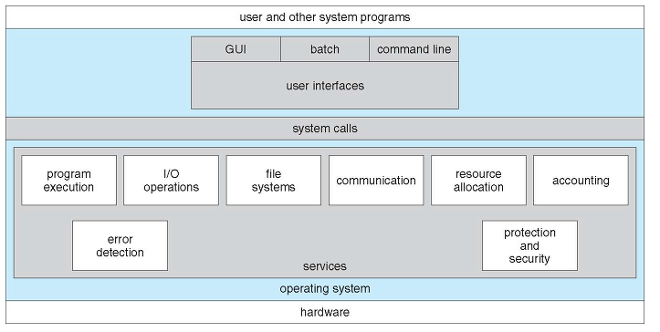

# OS의 작동원리

## OS란?

### Operating System

운영체제는 일반 컴퓨터나 노트북의 전원을 켜면 가장 먼저 만나게 되는 소프트웨어다. 

- 개인용 컴퓨터에서 사용하는 윈도우와 Mac
- 대형 컴퓨터에서 사용하는 유닉스와 리눅스 등이 있따.
- 스마트폰에도 쓰이는 모바일 운영체제 또한 있다. 
  애플의 iOS, 구글의 Android가 있다.
- MP3, 내비게이션, 스마트시계 ,스마트 TV등에도 운영체제가 있다. 이처럼 성능이 낮고 메모리 크기도 작은 운영체제를
  **임베디드 운영체제(Embedded operating system)**라고 한다.

### 운영체제의 필요성

초기의 컴퓨터는 정해진 계산만 수행했기 때문에 특별한 사용규칙이 필요 없었다. 그러나 성능이 점점 향상되고, 여러 작업을 동시에 할 수 있는 환경이 조성되면서 사용 규칙이 필요해졌다. 

컴퓨터는 운영체제가 없어도 작동하는가?

-> 작동한다. 에니악(ENIAC)은 4층짜리 큰 기계 덩어리였다. 운영체제도 없고 키보드와 모니터도 없었지만, 미사일 탄도 계산이라는 본래 목적을 충실하게 수행했다.  운영체제가 없는 에니악을 컴퓨터라고 부르는 이유는 프로그래밍이 가능했기 때문이다. 오늘날에는 키보드로 프로그래밍을 하였지만, 에니악은 전선의 연결을 직접 변경함으로써 프로그래밍 효과를 냈다. 기준에 따라 다를 수 있지만, 어떤 변화에 의해 기능을 바꾸는 기계를 컴퓨터라 한다면, 에니악은 컴퓨터에 속한다.

운영체제는 성능을 향상하는 데에만 필요한가?

-> 운영체제는 성능 향상뿐 아니라 자원관리 라는 중요한 역할도 한다. 우리는 컴퓨터를 사용 할 때, 카카오톡, 웹 브라우저, 노래, 메모 등을 동시에 사용하며, 각 응용프로그램의 자원 할당을 관리하는 강력한 중재자가 필요하다. 이 중재자는 누구에게 키보드 입력과 모니터 출력을 담당하게 할 지 등을 결정하고, 악의적인 응용프로그램으로부터 컴퓨터 자원을 보호하는 역할 또한 한다.

- 운영체제는 사용자가 직접 자원에 접근하는 것을 막음으로써 자원을 보호하고 관리한다.
- 운영체제는 사용자가 직접 자원에 접근하지 못하도록 하는 대신 자원을 이용할 수 있는 여러가지 방법을 제공한다. -> 인터페이스

중간의 파란색 부분이 운영체제에 해당한다.

