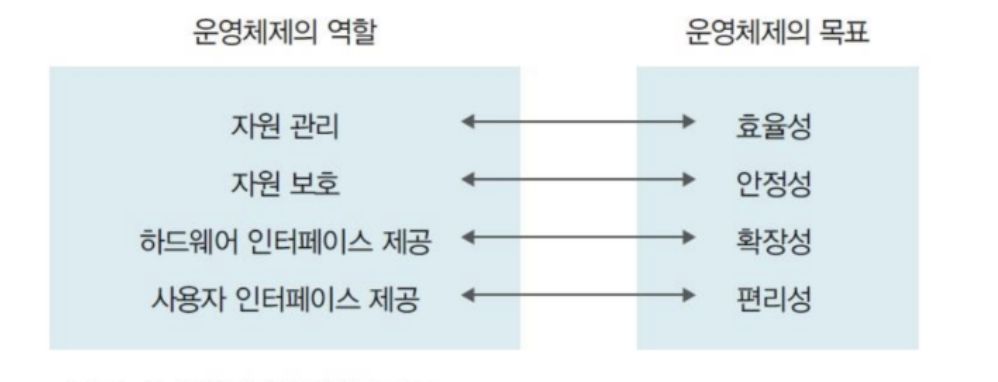
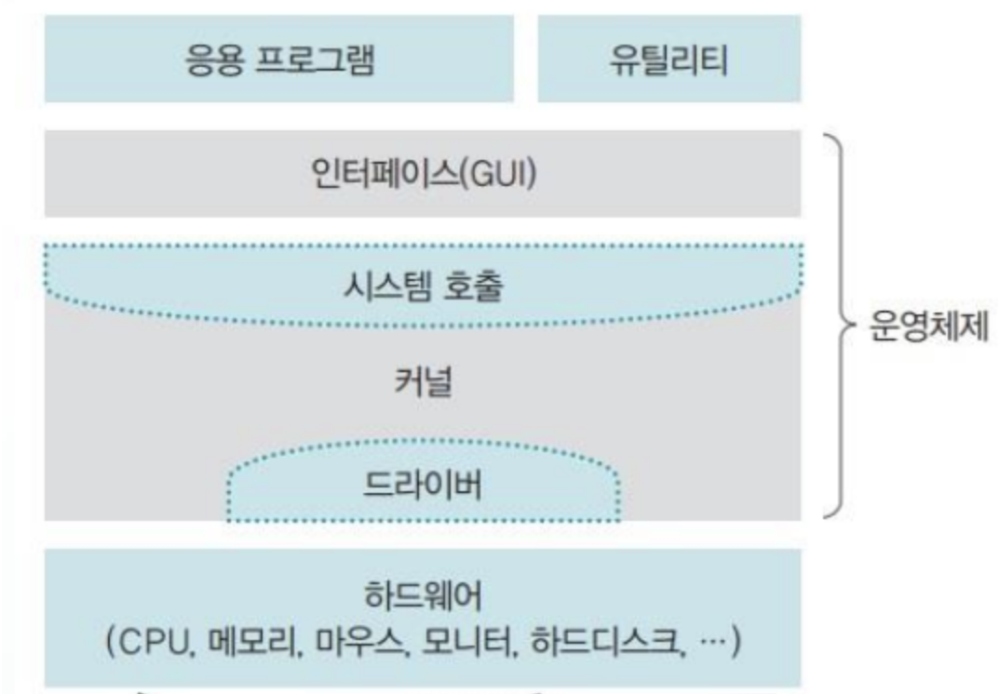
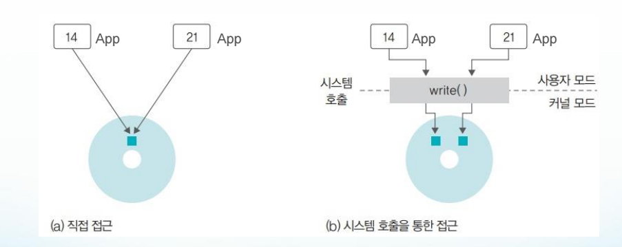
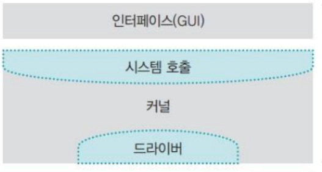
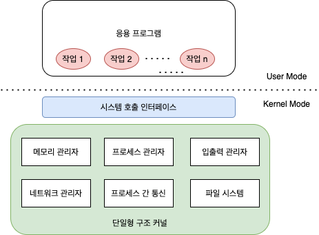
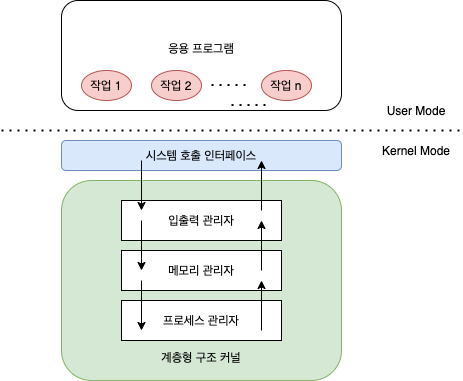
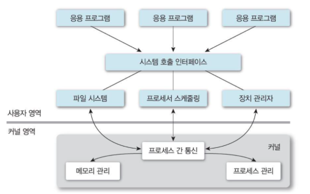

# OS의 작동원리

## OS란?

### Operating System

운영체제는 일반 컴퓨터나 노트북의 전원을 켜면 가장 먼저 만나게 되는 소프트웨어다. 

- 개인용 컴퓨터에서 사용하는 윈도우와 Mac
- 대형 컴퓨터에서 사용하는 유닉스와 리눅스 등이 있다.
- 스마트폰에도 쓰이는 모바일 운영체제 또한 있다. 
  애플의 iOS, 구글의 Android가 있다.
- MP3, 내비게이션, 스마트시계 ,스마트 TV등에도 운영체제가 있다. 이처럼 성능이 낮고 메모리 크기도 작은 운영체제를
  **임베디드 운영체제(Embedded operating system)**라고 한다.

### 운영체제의 필요성

초기의 컴퓨터는 정해진 계산만 수행했기 때문에 특별한 사용규칙이 필요 없었다. 그러나 성능이 점점 향상되고, 여러 작업을 동시에 할 수 있는 환경이 조성되면서 사용 규칙이 필요해졌다. 

컴퓨터는 운영체제가 없어도 작동하는가?

-> 작동한다. 에니악(ENIAC)은 4층짜리 큰 기계 덩어리였다. 운영체제도 없고 키보드와 모니터도 없었지만, 미사일 탄도 계산이라는 본래 목적을 충실하게 수행했다.  운영체제가 없는 에니악을 컴퓨터라고 부르는 이유는 프로그래밍이 가능했기 때문이다. 오늘날에는 키보드로 프로그래밍을 하였지만, 에니악은 전선의 연결을 직접 변경함으로써 프로그래밍 효과를 냈다. 기준에 따라 다를 수 있지만, 어떤 변화에 의해 기능을 바꾸는 기계를 컴퓨터라 한다면, 에니악은 컴퓨터에 속한다.

운영체제는 성능을 향상하는 데에만 필요한가?

-> 운영체제는 성능 향상뿐 아니라 자원관리 라는 중요한 역할도 한다. 우리는 컴퓨터를 사용 할 때, 카카오톡, 웹 브라우저, 노래, 메모 등을 동시에 사용하며, 각 응용프로그램의 자원 할당을 관리하는 강력한 중재자가 필요하다. 이 중재자는 누구에게 키보드 입력과 모니터 출력을 담당하게 할 지 등을 결정하고, 악의적인 응용프로그램으로부터 컴퓨터 자원을 보호하는 역할 또한 한다.

- 운영체제는 사용자가 직접 자원에 접근하는 것을 막음으로써 자원을 보호하고 관리한다.
- 운영체제는 사용자가 직접 자원에 접근하지 못하도록 하는 대신 자원을 이용할 수 있는 여러가지 방법을 제공한다. -> 인터페이스

중간의 파란색 부분이 운영체제에 해당한다.

## 운영체제의 목표

### 효율성

운영체제는 같은 자원을 관리하더라도 효율적으로 관리해야 한다. 적은 자원을 사용하여 결과를 빨리 보여주는 것이 효율적인 운영체제이다. 
일반적으로 운영체제의 크기를 최소화하고 운영체제가 사용하는 코드를 최적화해야한다.

### 안정성

작업을 안정적으로 처리할 수 있어야 한다.
응용프로그램의 안전 문제와 하드웨어적인 보안 문제를 처리할 수 있어야 한다.
시스템에 문제가 발생했을 때 이전으로 복구하는 결함포용(fault tolerance) 기능을 수행해야 한다.

### 확장성

운영체제는 다양한 시스템 자원을 추가하거나 제거하기가 편리해야 한다.
하드웨어의 종류에 상관없이 꽂으면 바로 실행할 수 있는 프러그 앤드 플레이 기능을 제공해야 한다.
확장성을 보장하기 위해서는 사용자의 편리성 뿐만 아니라, 하드웨어 제작자의 편리성도 고려해야 한다.

### 편리성

사용자가 편리하게 작업할 수 있는 환경을 제공해야 한다.
효율성을 높이기 위해서는 편리성이 줄고, 편리성을 늘리기 위해서는 효율성이 줄 수 있다.
따라서 사용자에게 다양한 편리성을 제공하면서도 자원의 낭비 요소를 막아야 한다.

# 운영체제의 구조

운영체제의 구조에 대해서 알아보겠습니다.

## 커널과 인터페이스

- 커널은 프로세스 관리, 메모리 관리, 저장장치 관리와 같은 운영체제의 핵심적인 기능을 모아놓은 것이다.
- **운영체제의 성능은 커널이 좌우한다**.
- 운영체제는 사용자와 응용 프로그램에 인접하여 커털에 명령을 전달하고 실행 결과를 리턴하는 인터페이스와 핵심 기능을 모아놓은 커널으로 나뉜다.  
- 운영체제는 커널과 인터페이스를 분리하여, 같은 커널을 사용하더라도 다른 인터페이스를 가진 형태로 제작할 수 있다.

## 시스템 호출

**시스템 호출(System call)**은 커널이 자신을 보호하기 위해 만든 인터페이스입니다. 커널은 컴퓨터 자원을 보호하기 위해 사용자나 응용프로그램이 자원에 직접 접근하는 것을 차단합니다. 따라서 자원을 이용하려면 시스템 호출이라는 인터페이스를 이용하여 접근해야 합니다.

- **직접 접근**: 사용자가 직접 자원에 접근하여 작업하는 방식으로 사용자가 모든 것을 처리해야 합니다.  사용자는 자기가 원하는 대로, 작업할 수 있지만 부주의로 컴퓨터 자원이 훼손될 수 있습니다.
- **시스템 호출을 통한 접근**: 누군가에게 요청하여 작업의 결과만 받는 방식입니다. 실제로 어떻게 구현되고, 동작하는 지 등을 신경 쓸 필요 없이 결과만 받으면 됩니다. 이 경우 사용자의 오작동이나 악의에 의해 자원이 망가지는 일을 막을 수 있습니다. 운영체제는 사용자나 응용 프로그램이 하드웨어에 직접 접근하지 못하도록 막음으로써 컴퓨터 자원을 보호합니다. 대신 하드웨어어 같은 시스템 자원을 사용할 수 있도록 인터페이스를 제공하는데 이것이 바로 시스템 호출입니다.

응용 프로그램은 직접 하드디스크에 데이터를 저장하지 않고, 커널이 제공하는 write함수를 사용하여 데이터를 저장해달라고 요청합니다.  

- 시스템 호출은 커널이 제공하는 시스템 자원의 사용과 연관된 함수입니다.
- 운영체제는 커널이 제공하는 서비스를 시스템 호출로 제한하고 다른 방법으로 커널에 들어오지 못하게 막음으로써 컴퓨터 자원을 보호합니다.
- 시스템 호출은 커널이 제공하는 서비스를 이용하기 위한 인터페이스이며, 사용자가 자발적으로 커널 영역에 진입할 수 있는 **유일한 수단**입니다.

## 드라이버

응용 프로그램과 커널의 인터페이스가 시스템 호출이라면 커널과 하드웨어의 인터페이스는 드라이버가 담당합니다. 각 하드웨어에 맞는 프로그램을 하드웨어 제작자가 관련 소프트웨어를 만드는 것이 유리합니다.  커널은 입출력의 기본적인 부분만 제작하고, 하드웨어의 특성을 반영한 소프트웨어를 하드웨어 제작자에게 받아 커널이 실행될 때 함께 실행되도록 합니다. 이때 하드웨어 제작자가 만든 소프트웨어를 **디바이스 드라이버**라고 부릅니다. 마우스, 키보드와 같이 복잡하지 않은 디바이스 드라이버는 커널에 포함되어 있어 컴퓨터에 꽃기만 하면 작동되지만 그래픽카드, 프린터와 같이 크기가 크고 복잡한 디바이스 드라이버는 사용자가 직접 설치해야 합니다.

위의 사진을 보면 시스템 호출 부분은 커널 압부분 전체를 감싸고 있는데, 이는 시스템 호출을 거치지 않고 커널에 진입할 수 없다는 의미입니다. 반면에 드라이버는 커널 전체를 감싸고 있지 않는데, 하드웨어는 커널과 직접 연결되기도 하고 하드웨어 제작자가 제공하는 드라이버도 있다는 뜻으로, 하드웨어는 커널과 직접 연결되기도 하고 제작자가 제공하는 드라이버를 통해 연결되기도 합니다.

## 커널의 구성

운영체제의 핵심 기능을 모아놓은 커널이 주로 하는 일은 프로세스 관리, 메모리 관리, 파일시스템 관리, 입출력 관리, 프로세스 간 통신 관리 등이 있습니다.

- 프로세스 관리 : 프로세스에 CPU를 배분하고 작업에 필요한 제반 환경을 제공합니다.
- 메모리 관리 : 프로세스에 작업 공간을 배치하고 실제 메모리보다 큰 가상공간을 제공합니다.
- 파일 시스템 관리 : 데이터를 저장하고 접근할 수 있는 인터페이스를 제공합니다.
- 입출력 관리 : 필요한 입력과 출력 서비스를 제공합니다.
- 프로세스 간 통신 관리 : 공동 작업을 위한 각 프로세스 간 통신 환경을 지원합니다.

커너르이 핵심 기능은 유기적으로 복잡하게 얽혀 있습니다. 커널은 이러한 기능이 어떻게 구현되어 있는가에 따라 
단일형 구조 커널, 계층형 구조 커널, 마이크로 구조 커널로 구분됩니다.

### 단일형 구조 커널

단일형 구조(Monolithic architecture) 커널은 초창기의 운영체제 구조로, 커널의 핵심 기능을 구현하는 모듈들이 구분 없이 하나로 구성되어 있습니다. 단일형 구조에 속하는 대표적인 운영체제는 MS-DOS, VMS, 초기의 운영체제입니다. 
단일형 구조는 함수를 거의 사용하지 않고 main()에 모든 기능을 구현한 형태와 같습니다.

#### 장점

- 모듈이 거의 분리되지 않았기 때문에 모듈 간의 통신 비용이 줄어들어 효율적인 운영이 가능합니다.

#### 단점

- 모든 모듈이 하나로 묶여 있기 때문에 버그나 오류를 처리하기 어렵습니다.
- 운영체제의 여러 기능이 서로 연결되어 있어 상호 의존성이 높기 때문에 기능상의 작은 결함이 시스템 전체로 확산될 수 있습니다.
- 다양한 환경의 시스템에 적용하기 어렵습니다.
- 현대의 운영체제는 매우 크고 복잡하기 때문에 완전 단일형 구조의 운영체제를 구현하기가 어렵습니다.

### 계층형 구조 커널

계층형 구조 커널(Layered architecture)은 단일형 구조 커널이 발전된 형태로, 비슷한 기능을 가진 모듈을 묶어서 하나의 계층으로 만들고 계층 간의 통신을 통해 운영체제를 구현하는 방식입니다.  비슷한 기능을 모아 모듈화 했기 때문에 단일형 구조보다 버그나 오류를 쉽게 처리할 수 있습니다. 오류가 발생했을 때 전체 커널을 고치지 않고 해당 계층만 따로 수정하면 되기 때문에 디버깅 하기가 쉽습니다.

마이크로소프트의 윈도우를 비롯해 오늘날의 운영체제는 대부분 이 구조로 이루어져 있습니다.

### 마이크로 구조 커널

계층형 구조의 접근 방식과 반대로 개발된 커널이 마이크로 구조(Micro architecture) 커널입니다.

마이크로 구조 커널의 운영체제는 프로세스 관리, 메모리 관리, 프로세스 간 통신 관리 등 가장 기본적인 기능만 제공합니다. 커널의 구조를 살펴보면 다른 커널에 비해 운영체제의 많은 부분이 사용자 영역에 구현되어 있습니다. 

- 각 모듈은 독립적으로 작동하기 때문에 하나의 모듈이 실패하더라도 전체 운영체제가 멈추지 않습니다. 
- 커널이 가볍습니다.( 커널은 기본적인 기능만 제공)
- 실시간 시스템에 활용하기 좋습니다.

