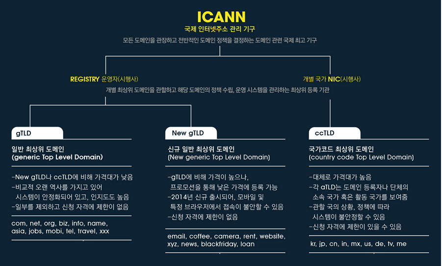

# DNS와 작동원리

## 추천사이트, 참고

- [CLOUDFLARE](https://www.cloudflare.com/ko-kr/learning/dns/what-is-dns/)
- [gentlysallim](https://gentlysallim.com/dns%EB%9E%80-%EB%AD%90%EA%B3%A0-%EB%84%A4%EC%9E%84%EC%84%9C%EB%B2%84%EB%9E%80-%EB%AD%94%EC%A7%80-%EA%B0%9C%EB%85%90%EC%A0%95%EB%A6%AC/)
- [amazon](https://aws.amazon.com/ko/route53/what-is-dns/)

### DNS란

DNS(Domain Name System)는 인터넷 전화번호부입니다.  숫자로 된 IP주소를 사람이 읽기 쉬운 문자로 바꾸어 연결 시켜주는 서비스 입니다.

인터넷에 연결된 각 기기에는 IP주소가 주어지며, 이는 방대한 인터넷에서 원하는 웹을 찾을 때 주소로 사용됩니다. 사용자가 특정한 웹 페이지를 로드할 때에는 사용자가 입력한 naver.com과 같은 읽기 쉬운 주소를 컴퓨터가 읽을 수 있는 주소로 변환시켜줍니다. 

### DNS 라우팅 과정

1. Client는 웹 브라우저에서 웹 주소(www.example.com)를 입력합니다.
2. 해당 주소에 대한 요청은 일반적으로 케이블 인터넷 공급업체, DSL 광대역 공급업체 또는 기업 네트워크 같은 인터넷 서비스 제공업체 (ISP)가 관리하는 DNS 해석기(DNS resolver)로 라우팅됩니다.
3. ISP의 DNS 해석기는 www.example.com에 대한 요청을 DNS 루트 이름 서버에 전달합니다.(ICANN)
4. ISP의 DNS 해석기는 www.example.com에 대한 요청을 이번에는 .com 도메인의 TLD이름 서버 중 하나에 전달합니다. 
5. ISP의 DNS 해석기는 Amazon Route 53 이름 서버 하나를 선택해 www.example.com에 대한 요청을 해당 이름 서버에 전달합니다.
6. Amazon Route 53 이름 서버는 example.com 호스팅 영역에서 www.example.com 레코드를 찾아 웹 서버의 IP 주소 192.0.2.44 등 연관된 값을 받고 이 IP 주소를 DNS 해석기로 반환합니다.
7. ISP의 DNS 해석기가 마침내 사용자에게 필요한 IP 주소를 확보하게 됩니다. 해석기는 이 값을 웹 브라우저로 반환합니다. 또한, DNS 해석기는 다음에 누군가가 example.com을 탐색할 때 좀 더 빠르게 응답할 수 있도록 사용자가 지정하는 일정 기간 동안 example.com의 IP 주소를 캐싱(저장)합니다.
8. 웹 브라우저는 DNS 해석기로부터 얻은 IP 주소로 www.example.com에 대한 요청을 전송합니다.
9. 192.0.2.44에 있는 웹 서버 또는 그 밖의 리소스는 www.example.com의 웹 페이지를 웹 브라우저로 반환하고, 웹 브라우저는 이 페이지를 표시합니다.

## ICANN

ICANN doesn’t control content on the Internet. It cannot stop spam and it doesn’t deal with access to the Internet. But through its coordination role of the Internet’s naming system, it does have an important impact on the expansion and evolution of the Internet.

A domain name itself comprises two elements: before and after “the dot”. The part to the right of the dot, such as “com”, “net”, “org” and so on, is known as a “top-level domain” or TLD. One company in each case (called a registry), is in charge of all domains ending with that particular TLD and has access to a full list of domains directly under that name, as well as the IP addresses with which those names are associated. The part before the dot is the domain name that you register and which is then used to provide online systems such as websites, email and so on. These domains are sold by a large number of “registrars”, free to charge whatever they wish, although in each case they pay a set per-domain fee to the particular registry under whose name the domain is being registered.

ICANN draws up contracts with each registry. It also runs an accreditation system for registrars. It is these contracts that provide a consistent and stable environment for the domain name system, and hence the Internet.

ICANN은 인터넷의 컨텐츠를 제어하지는 않습니다. 스팸을 차단하거나 인터넷 액세스를 취급하는 일도 하지 않습니다. 하지만 인터넷 명명 시스템의 조정적 역할을 통해 인터넷의 확장과 발전에 중요한 영향을 미치고 있습니다.

도메인 이름 자체는 "점" 앞뒤의 두 개 요소로 구성되어 있습니다. 점 뒷부분인 “com”, “net”, “org” 등은 “최상위 도메인” 또는 TLD로 알려져 있습니다. 각 경우에 한 회사(레지스트리라고 불림)가 특정 TLD로 끝나는 모든 도메인을 책임지고 있으며 해당 이름 바로 아래에 있는 전체 도메인 목록 및 이러한 이름이 연관되어 있는 IP 주소에 액세스할 수 있습니다. 점 앞부분은 사용자가 등록하는 도메인 이름이며 웹 사이트, 전자 메일 등과 같은 온라인 시스템을 제공하는 데 사용됩니다. 이러한 도메인은 다수의 "등록기관"에 의해 판매되며, 등록기관은 도메인에 원하는 비용을 부과할 수 있습니다. 단, 판매할 때마다 등록기관은 도메인이 등록되는 이름에 따른 특정 레지스트리에 정해진 도메인별 요금을 지불합니다.

ICANN은 각 레지스트리와 계약을 체결합니다. 또한 등록기관 인가 시스템을 운영하기도 합니다. 이러한 계약이 도메인 이름 시스템(결국, 인터넷)에 일관되고 안정적인 환경을 제공합니다.

**ICANN은 어떤 역할을 합니까?**

앞서 언급했듯이 ICANN의 역할은 수많은 컴퓨터가 인터넷에서 서로를 찾을 수 있게 하는, 상호 연결된 대규모의 복잡한 고유 식별자 네트워크를 감독하는 것입니다.

이를 일반적으로 “보편적 분해능”이라고 하며 네트워크나 전 세계 어느 곳에 있든 간에 네트워크에 액세스할 때 예측 가능한 동일한 결과를 얻는다는 것을 의미합니다. 이러한 역할이 없으면 사용자 위치에 따라 인터넷이 완전히 다르게 작동할 수 있습니다.

**ICANN은 어떤 구조입니까?**

ICANN은 인터넷에서 다양한 이해를 대변하고 ICANN의 최종 결정에 모두 이바지하는 여러 그룹으로 구성되어 있습니다.

각기 다음을 대변하는 세 개의 “지원 조직”이 있습니다.

- IP 주소를 다루는 조직
- 도메인 이름을 다루는 조직
- 국가 코드 최상위 도메인의 관리자.

그런 다음 ICANN에 자문과 추천을 하는 네 개의 "자문 위원회"가 있습니다. 이들은 각기 다음을 대변합니다.

- 정부 및 국제 협약 조직
- 루트 서버 운영자
- 인터넷 보안 관리 그룹
- 평균적인 인터넷 사용자를 의미하는 “일반” 커뮤니티

마지막으로 인터넷 기술의 기본 프로토콜을 고안하는 조직과 협업하는 기술 연락 그룹이 있습니다.

ICANN의 최종 결정은 이사회에서 내려집니다. 이사회는 21명의 회원으로 구성되며 이 중 15명은 투표권이 있고 6명은 투표권이 없습니다. 투표권이 있는 구성원 중 다수(8명)는 독립적인 지명위원회에 의해 선출되고 나머지는 지원 조직의 지정된 구성원입니다.

ICANN에는 사장 겸 CEO가 있습니다. 이 직위에 있는 사람은 이사회의 회원으로서, 세계 각지에 있는 ICANN 실무진에게 업무를 지시하고, 지원 조직 및 자문 위원회가 결정한 여러 가지 의견과 결정을 조정 및 관리하고 구현하는 데 도움을 줍니다. ICANN 옴부즈맨은 ICANN 실무진 및 이사회의 업무를 독립적으로 검토하는 역할을 합니다.

출처 - ICANN 공식 사이트

## TLD

