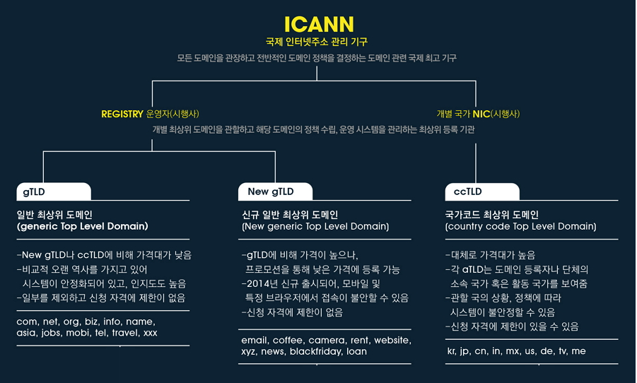

# 도메인 이름이란?

### 추천사이트, 출처

- [DNS와 작동원리(이전 포스트)](https://github.com/Woongstar/Road-to-Backend-Developer/blob/main/%EC%9D%B8%ED%84%B0%EB%84%B7(Internet)/DNS%EC%99%80%20%EC%9E%91%EB%8F%99%EC%9B%90%EB%A6%AC.md)
- [한국 인터넷 정보 센터](https://xn--3e0bx5euxnjje69i70af08bea817g.xn--3e0b707e/jsp/resources/domainInfo/domainInfo.jsp)
- [google cloud support](https://support.google.com/a/answer/2573637?hl=ko)

## 도메인

도메인은 인터넷에 연결된 컴퓨터를 사람이 쉽게 기억하고 입력할 수 있도록 문자(영문, 한글 등)로 만든 인터넷주소입니다.

## 도메인 체계

도메인은 “.”또는 루트(root)라 불리는 도메인 이하에 아래 그림과 같이 역트리(Inverted tree)구조로 구성되어 있습니다.
루트 도메인 바로 아래의 단계를 1단계 도메인 또는 최상위 도메인(TLD, Top Level Domain)이라고 부르며, 그 다음 단계를 2단계 도메인(SLD, Second Level Domain)이라고 부릅니다

### 하위도메인

하위 도메인은 전체 도메인의 일부인 도메인입니다. 예를 들어 mail.google.com, www.google.com, docs.google.com은 모두 google.com 도메인의 하위 도메인입니다. 도메인 소유자는 하위 도메인을 만들어 최상위 도메인 내의 웹 페이지나 서비스에 기억하기 쉬운 주소를 제공할 수 있습니다.

### 네이키드 도메인

네이키드 도메인은 www.google.com(네이키드 아님) 대신 google.com(네이키드)처럼 'www' 접두사가 없는 도메인 이름입니다

### 기본 도메인

기본 도메인은 회사 계정에 가입할 때 사용한 도메인입니다. 나중에 계정에 다른 도메인을 추가할 수 있습니다.

### 보조 도메인

기본 도메인 외에 계정에 다른 도메인을 추가하여 다른 도메인에 있는 사용자도 서비스를 이용할 수 있도록 할 수 있습니다. 고유의 사용자가 있는 도메인을 추가하는 경우 그 도메인을 **보조 도메인**이라고 합니다.

## 도메인 종류

도메인에는 국가도메인(ccTLD, country code Top Level Domain)과 일반도메인(gTLD, generic Top Level Domain)이 있습니다.

국가도메인은 인터넷 상에서 국가를 나타내는 도메인으로 ‘.kr(대한민국) .jp(일본), .cn(중국), .us(미국) 등 영문으로 구성된 영문 국가도메인이 있습니다. 또한 ‘.한국(대한민국)’, ‘중국(중국), .러시아(러시아), .이집트(이집트)처럼 자국어 국가도메인이 있습니다.

일반도메인은 ‘.com(회사)’, ‘.net(네트워크 관련기관)’, ‘org(비영리기관)’, ‘.biz(사업)’ 등 등록인의 특성에 따라 사용할 수 있는 도메인입니다.

