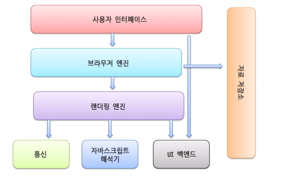
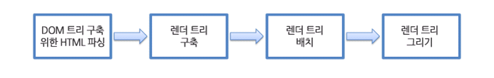
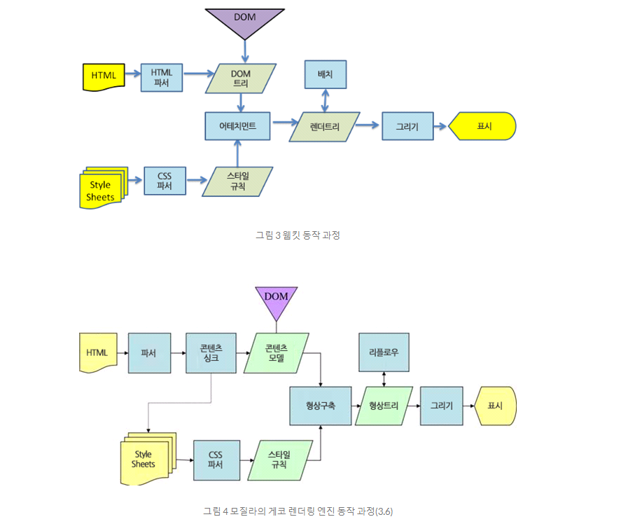
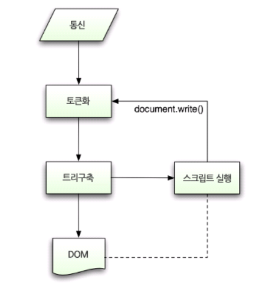
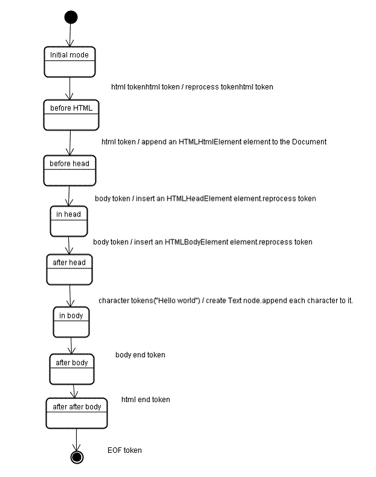

# 브라우저와 작동원리

### 추천사이트, 출처

- [How's the broswer works](https://www.html5rocks.com/en/tutorials/internals/howbrowserswork/)  -> 네이버 번역 [브라우저는 어떻게 동작하는가?](https://d2.naver.com/helloworld/59361)
- [유튜브 두원이](https://www.youtube.com/watch?v=cCbAJY1riDc)
- [MDN-HTML](https://developer.mozilla.org/ko/docs/Learn/Getting_started_with_the_web/HTML_basics)
- 직접 따라 쳐가며 요약하고, 어색한 어감을 자연스럽게 수정하였습니다.


## 브라우저의 주요 기능

브라우저의 주요 기능은 사용자가 선택한 자원을 서버에 요청하고 브라우저에 표시하는 것입니다. 자원은 보통 HTML 문서지만 PDF나 이미지 또는 다른 형태일 수 있다. 자원의 주소는 **URI(Uniform Resource Identifier)**에 의해 정해집니다.

브라우저는 HTML과 CSS 명세에 따라 HTML 파일을 해석해서 표시하는데 이 명세는 웹 표준화 기구인 W3C(World Wide Web Consortium)에서 정해집니다.  과거에는 브라우저들이 일부만 이 명세에 따라 구현하고 독자적인 방법으로 확장함으로써 웹 제작자가 심각한 호환성 문제를 겪었지만 최근에는 대부분의 브라우저가 표준 명세를 따릅니다.

브라우저의 사용자 인터페이스는 표준 명세가 없음에도 불구하고 수 년간 서로의 장점을 모방하면서 현재에 이르게 되었습니다. HTML5 명세는 주소 표시줄, 상태 표시줄, 도구 모음과 같은 일반적인 요소를 제외하고 브라우저의 필수 UI를 따로 정의하지 않습니다. 


## 브라우저의 기본 구조



1. 사용자 인터페이스 - 주소 표시줄, 이전/다음 버튼, 북마크 메뉴 등. 요청한 페이지를 보여주는 창을 제외한 나머지 모든 부분입니다.
2. 브라우저 엔진 - 사용자 인터페이스와 렌더링 엔진 사이의 동작을 제어합니다.
3. 렌더링 엔진 - 요청한 콘텐츠를 표시합니다. 예를 들어 HTML을 요청하면 HTML과 CSS를 파싱하여 화면에 표시합니다.
4. 통신 - HTTP 요청과 같은 네트워크 호출에 사용됩니다. 이것은 플랫폼 독립적인 인터페이스이고 각 플랫폼 하부에서 실행됩니다.
5. UI 백엔드 - 콤보 박스와 창 같은 기본적인 장치를 그립니다. 플랫폼에서 명시하지 않은 일반적인 인터페이스로서, OS 사용자 인터페이스 체계를 사용.
6. 자바스크립트 해석기 - 자바스크립트 코드를 해석하고 실행.
7. 자료 저장소 - 이 부분은 자료를 저장하는 계층이다. 쿠키를 저장하는 것과 같이 모든 종류의 자원을 하드 디스크에 저장할 필요가 있다. HTML5 명세에는 브라우저가 지원하는 웹 데이터베이스가 정의되어 있다.

**크롬은 대부분의 브라우저와 달리 각 탭마다 별도의 렌더링 엔진 인스턴스를 유지합니다**. -> 각 탭은 독립된 인스턴스로 유지된다


## 렌더링 엔진은 요청 받은 내용을 브라우저 화면에 표시합니다.

렌더링 엔진은 HTML 및 XML 문서와 이미지를 표시할 수 있습니다. HTML과 CSS로 이루어진 페이지를 표시하는 것 뿐만 아니라 플러그인이나 브라우저 확장 기능을 이용해 PDF와 같은 다른 유형도 화면에 띄울 수 있습니다. 이 페이지 에서는 HTML과 CSS를 활용한 웹페이지 표현에 관한 것을 포스팅합니다.

 파이어폭스는 렌더링 엔진으로 모질라에서 직접 만든 **게코(Gecko) 엔진**을 사용하고 사파리와 크롬은 **웹킷(Webkit) 엔진**을 사용합니다.

### 렌더링 엔진의 동작과정

렌더링 엔진은 통신으로부터 요청한 문서의 내용을 얻는 것으로 시작하는데 문서의 내용은 보통 8kb 단위로 전송됩니다.



렌더링 엔진은 HTML 문서를 파싱하고, **콘텐츠 트리** 내부에서 태그를 DOM노드로 변환합니다. 그 다음 외부 CSS파일과 함께 포함한 스타일 요소를 파싱합니다. 
스타일 정보와 HTML표시 규칙은 **렌더트리**라 부르는 또 다른 트리를 생성하여 저장합니다.

렌더트리는 색상 또는 면적과 같은 시각적 속성이 있는 사각형을 포함하고 있는데 정해진 순서대로 화면에 표시됩니다.

렌더트리 생성이 끝나면 배치가 시작되는데, 이것은 각 노드가 화면의 정확한 위치에 표시되도록 합니다. 

렌더트리 그리기에서는 UI백엔드에서 각 노드를 가로지르며 형상을 만들어 냅니다.

>  **렌더링 엔진은 가능하면 빠르게 내용을 표시하려 하는데 모든 HTML을 파싱할 때까지 기다리지 않고 배치와 그리기 과정을 시작합니다. 네트워크로부터 나머지 내용이 전송되기를 기다림과 동시에 받은 내용의 일부를 먼저 화면에 표시합니다.**



위의 그림 3은 사파리와 크롬의 Webkit엔진, 그림 4는 파이어폭스의 Gecko엔진의 동작과정 입니다.

게코는 시각적으로 처리되는 렌더 트리를 "형상 트리(frame tree)"라고 부르고 각 요소를 형상(frame)이라고 하는데 웹킷은 "렌더 객체(render object)"로 구성되어 있는 "렌더 트리(render tree)"라는 용어를 사용합니다. 웹킷은 요소를 배치하는데 "배치(layout)" 라는 용어를 사용하지만 게코는 "리플로(reflow)" 라고 부릅니다. "어태치먼트(attachment)"는 웹킷이 렌더 트리를 생성하기 위해 DOM 노드와 시각 정보를 연결하는 과정을 뜻합니다. 게코는 HTML과 DOM 트리 사이에 "콘텐츠 싱크(content sink)"라고 부르는 과정을 두는데 이는 DOM 요소를 생성하는 것으로 웹킷과 비교하여 의미있는 차이점이라고 보지는 않습니다.

웹킷(Webkit)         ->           게코 (Gecko)

렌더트리(render tree)  -> 형상트리(frame tree, 

렌더객체(render object)  -> 형상(frame)

배치(Layout) -> 리플로(Reflow)

어태치먼트(Attachment) -> 콘텐츠 싱크(Content 싱크)


### HTML 파서

HTML 파서는 HTML 마크업을 파싱 트리로 변환합니다. HTML의 어휘와 문법은 W3C에 의해 명세로 정의되어 있습니다.

> HTML의 특징중 하나는 "너그럽다"는 점입니다.  HTML은 암묵적으로 태그에 대한 생략이 가능합니다. 가끔 시작 또는 종료 태그 등을 생략할 수 잇습니다. 
>
>  전반적으로 뻣뻣하고 부담스러운 XML에 반하여 HTML은 "유연한" 문법입니다.


### DOM

[DOM(MDN)](https://developer.mozilla.org/ko/docs/Web/API/Document_Object_Model/Introduction)

문서 객체 모델(The Document Object Model, 이하 DOM) 은 HTML, XML 문서의 프로그래밍 interface 입니다. DOM은 문서의 구조화된 표현(structured representation)을 제공하며 프로그래밍 언어가 DOM 구조에 접근할 수 있는 방법을 제공하여 그들이 문서 구조, 스타일, 내용 등을 변경할 수 있게 돕는다. DOM 은 구조화된 nodes와 property 와 method 를 갖고 있는 objects로 문서를 표현합니다. 이들은 웹 페이지를 스크립트 또는 프로그래밍 언어들에서 사용될 수 있게 연결시켜주는 역할을 담당합니다.

DOM 은 동일한 문서를 표현하고, 저장하고, 조작하는 방법을 제공합니다. DOM 은 웹 페이지의 객체 지향 표현이며, 자바스크립트와 같은 스크립팅 언어를 이용해 DOM 을 수정할 수 있습니다.

#### 파싱 알고리즘

앞서 말한대로 HTML은 일반적인 하향식 또는 상향식 파서로 파싱이 안되는데 그 이유는 약 세가지가 있습니다.

1. 언어의 너그러운 속성.
2. 잘 알려져 있는 HTML 오류에 대한 브라우저의 관용.
3. 변경에 의한 재파싱. 일반적으로 소스는 파싱하는 동안 변하지 않지만 HTML에서 document.write을 포함하고 있는 스크립트 태그는 토큰을 추가할 수 있기 때문에 실제로는 입력 과정에서 파싱이 수정됩니다.

HTML에서는 일반적인 파싱 기술을 사용할 수 없기 때문에 브라우저는 HTML 파싱을 위해 별도의 파서를 생성합니다. -> [HTML문서 참조](https://html.spec.whatwg.org/multipage/parsing.html)



### 트리 구축 알고리즘

파서가 생성되면 문서 객체가 생성됩니다. 트리 구축이 진행되는 동안 문서 최상단에서는 DOM트리가 수정되고 요소가 추가됩니다. 토큰화에 의해 만들어진 각 노드는 트리 생성자에 의해 처리됩니다.  DOM트리에 요소를 추가하는 것이 아니라면 열린 요소는 스택(임시 버퍼 저장소)에 추가됩니다. 이 스택은 부정확한 중첩과 종료되지 않은 태그를 수정해 줍니다. 

```html
 <html>
   <body>
      Hello world
   </body>
</html>  
```

 

트리 구축 단계의 입력 값은 토큰화 단계에서 만들어지는 일련의 토큰입니다. 가장 초기의 모드는 **"Initial mode"**입니다. 이 모드에서 받은 HTML토큰은 **"before HTML"**모드가 되고 토큰은 이 모드에서 처리됩니다.
이것은 HTMLHtmlElement 요소를 추가하고 문서 객체의 최상단에 추가됩니다.

위의 단계로 인하여 **"before head "** 모드로 바뀌었고 body토큰을 받았습니다. 위의 코드에서는 head토큰이 없는데 head 토큰이 없더라도 HTMLHeadElement는 묵시적으로 생성되어서 트리에 추가됩니다.

이후 **"in head"** 모드로 이동하였고 바로 "**after head**" 모드로 바뀝니다. body 토큰이 처리되고 HTMLBodyElement가 생성되어 추가됐으며, "**in body**"모드로 바뀝니다.

"**in body**"모드에서 "Hellow world" 문자열의 문자 토큰을 받았습니다. 첫 번째 토큰이 생성되고 **"Text"** 노드가 추가되면서 다른 문자들이 그 노드에 추가 됩니다.

body 종료 토큰을 받으면 **"after body"** 모드가 됩니다. html 종료 태그를 만나면 **"after after body"** 모드로 바뀝니다. 마지막 파일 토큰을 받으면 파싱을 종료하게 됩니다.

#### 파싱이 끝난 이후의 동작

이번 단계에서 브라우저는 문서와 상호작용할 수 있게 되고 문서 파싱 이후에 실행되어야 하는 **"지연(differed)"** 모드 스크립트를 파싱하기 시작합니다. 문서 상태는 **"완료(complete)"**가 되고 **"로드(load)"** 이벤트가 발생합니다.


## 브라우저가 오류를 처리하는 방법

#### 브라우저의 오류 처리

HTML 페이지에서 "유효하지 않은 구문" 이라는 오류를 본 적이 없을 것입니다. 이는 브라우저가 모든 오류 구문을 알아서 교정하기 때문입니다.

```html
<html>  
   <mytag></mytag>
   <div>
     <p>
   </div>
   Really lousy HTML
   </p>
</html>  
```

위의 오류 코드를 보면, "mytag"는 표준 태그가 아니고 "p" 태그와 "div" 태그는 중첩 오류가 있습니다. 그러나 브라우저는 오류문을 프린트하지 않고 올바르게 표시하는데 이는 파서가 HTML 제작자의 실수를 수정했기 때문입니다.

