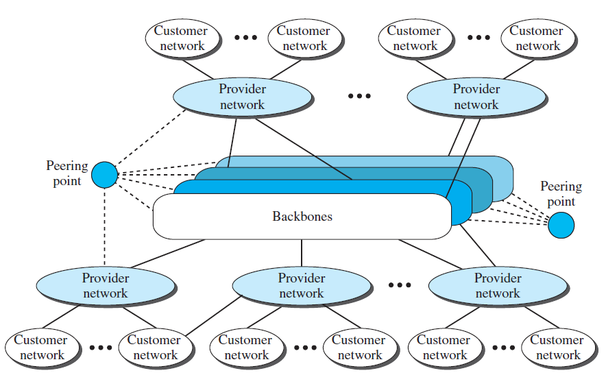
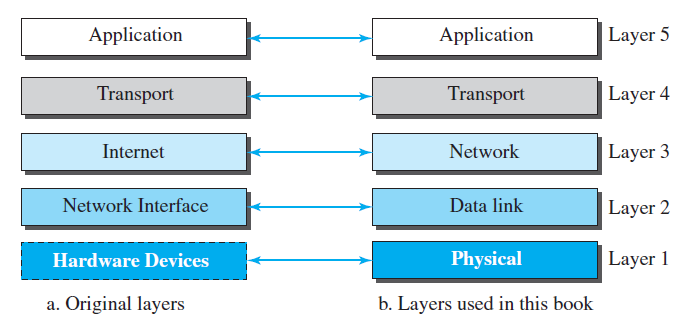

# 인터넷의 작동 원리

## 인터넷

internet: 2개 이상의 통신망들이 상호 연결되어 있는 통합망 (소문자 i의 인터넷)

Internet: 2개 이상의 통신망들이 TCP/IP 프로토콜로 상호 연결 되어있는 통합망 (대문자 I의 인터넷)

백본(기간망) = 망과 망이 연결되어있는 망 = 통신망들을 상호 연결하는 통신망

ex) KT,SKT,Verizon,AT&T

- 백본망끼리이의 연결점 = 대등점 (peering point)
- 두번째 레벨 = 제공자 네트워크 (provider network)
- 백본(Backbone)과 제공자 네트워크는 인터넷 서비스 제공자(ISP: Internet Service Provider)라고도 불린다.
  - 백본은 주로 국제 인터넷 서비스 제공자(International ISP)라고 불리고, 제공자 네트워크는 지구 인터넷 서비스 제공자(regional ISP)라고 불린다.

## 인터넷 접속

1. 전화망 이용
   오늘날에 대부분의 가정에서는 전화망이 연결되어 있기 때문에, 전화국 사이의 음성 선을 점대점 WAN으로 바꾸어 인터넷을 이용할 수 있다.
    - Dial-up Service(다이얼업 서비스)
    전화선에 데이터를 음성으로 바꾸어 줄 수 있는 모뎀을 설치하는 것.
     컴퓨터에 설치된 소프트웨어가 ISP를 호출하고, 전화 연결처럼 만든다.
     매우 느리고, 인터넷에 연결되는 동안 전화를 사용할 수 없다.
     가끔 인터넷에 연결하려고 할 때 유용하다.
    - DSL Service
    전화선을 업그레이드 시켜 전화선 중 남는 대역폭을 인터넷 통신에 사용할 수 있게 한다.
2. 케이블망 이용(CATV 네트워크)
케이블 TV 서비스의 케이블 망을 업그레이드 하여 인터넷에 연결 → 빠른 연결을 제공하지만, 같은 케이블을 이용하는 이웃의 수에 따라 속도가 변한다.
3. 무선망 이용
Wireless(무선) 연결은 최근들어 대중화 되고 있다. 휴대전화를 위한 이동체 통신망을 이용한다. 휴대전화 적용 기술에 좌우된다.
4. 직접 연결
큰 회사가 제공업자로부터 고속 WAN을 임대하여 지역 ISP가 되어 연결한다.

### 데이터 흐름 방향

### Simplex mode(단방향 방식)

- 한쪽 방향으로만 일어난다.
- 두 장치간에 한쪽은 전송만 할 수 있고, 다른 쪽은 수신만 할 수 있다.

### Half-duplex mode(반 이중 방식)

- 각 장치는 송신과 수신이 가능하지만, 동시에는 할 수 있다.
- 채널의 전체 용량은 각 방향에 대해 전부 사용될 수 있다.
- ex) 워키토키, 민간방송용 라디오(CB radio)

### Full-duplex mode(전이중 방식)

- 양쪽 장치가 동시에 송신과 수신을 할 수 있다.
- 신호는 링크의 용량을 공유해서 양방향으로 전달된다.
- 송신과 수신이 서로 다른 전송 통로를 갖게 하거나, 채널의 전송 용량을 반으로 나누는 두가지 방법으로 이루어질 수 있다.

# 네트워크

통신이 가능한 서로 연결된 장치의 모임이다.

### Host(End system, 종단 시스템)

- 컴퓨터, 데스크톱, 랩톱, 워크스테이션, 폰, 보안 시스템 등의 장치

### Connecting Device(연결 장치)

- 네트워크와 다른 네트워크를 연결하는 라우터
- 서로 장치들을 연결하는 교환기
- 데이터의 형태를 변경하는 모뎀(변복조기)

## Network Criteria(네트워크 평가 기준)

### Performance(성능)

- 전달시간 : 메시지가 한 장치에서 다른 장치로 이동하는 데 걸리는 시간.
- 응답시간 : 요구와 응답에 경과된 시간
- 사용자 수, 전송매체의 종류, 연결된 하드웨어의 성능, 소프트웨어의 효율성 등의 영향을 받음
- 처리량(Throughput)과 지연(Delay)으로 평가됨
지연이 적을수록, 처리량은 많을수록 성능은 좋아진다.
- 처리량이 늘어나면 지연시간이 늘어난다.

### Reliability(신뢰성)

- 망실패율
- 복구소요시간
- 네트워크 견강성 등을 나타냄

## Physical Structures (물리적 구조)

### Point-to-point connection(점대점 연결)

점대점 연결은 두 장치 간의 전용 링크를 제공한다, 채널의 전체 용량은 두 기기 간의 전송을 위해서만 사용한다. 대부분 양쪽 끝에 연결된 케이블이나 전선을 사용한다. 극초단파나 인공위성 연결과 같은 방식도 가능하다. 저고이선 리모콘으로 텔레비전 채널을 바꿀 때 제어 시스템과 리모콘 간에는 점대점 연결이 이루어진다.

### Multipoint(다중점 연결, Multidrop)

- 3개 이상의 특정 기기가 하나의 링크를 공유하는 방식
- 채널의 용량은 공간적으로 혹은 시간적으로 공유된다.
- 여러 기기가 동시에 링크를 사용한다면 → 공간적 공유
- 순서에 따라 링크를 사용한다면 → 시간적 공유

## Physical topology(물리적 접속 형태)

- 물리적 혹은 논리적인 네트워크 배치 방식
- Node → 링크에 연결된 장비

### Mesh topology(그물형 접속 형태)

- 모든 장치는 다른 장치에 대해 전용의 점대점 링크를 갖는다.
- 모든 노드는 n-1개의 노드와 연결되어야 한다.
- n(n-1)/2개의 링크가 필요하다.

**장점**

- 전용 링크의 사용은 통신량 문제를 없애준다.
- 안전성이 높다.
- 프라이버시와 보안에 좋다.

**단점**

- 모든 장치와 연결되어야 하기에 설치와 재구성이 어렵다.
- 실제 필요한 전선의 용량이 크다
- 비용이 많이 든다.
- ex) 전화 지역국들 사이의 연결

### Star topology(스타형 접속 형태)

- 각 장치는 Hub(허브)라 불리는 중앙 제어장치와 전용 점대점 링크를 갖는다.
- 각 장치는 서로 직접 연결되어 있지 않다.
- 각 장치간 직접전인 통신이 불가능 하다.

**장점**

- 그물형보다 비용이 적게 든다.
- 설치와 재구성이 쉽다.
- 안정성이 높다. → 결함의 식별과 분리가 쉽다.

**단점**

- 전체 시스템이 허브라는 단일 장치에 좌우된다.
- 링형, 버스형보다 많은 케이블 연결을 필요로 한다.
- 모든 데이터가 중앙제어기를 거쳐 병목현상이 생김 → 성능이 떨어짐

### Bus topology(버스형 형태)

- 다중점(Multipoint) 형태로써 하나의 긴 케이블이 네트워크 상의 모든 장치를 연결하는 중추(backbone) 네트워크 역할을 한다.
- 노드는 Tap과 drop line(유도선)에 의해 버스에 연결된다.

**장점**

- 설치가 쉽다.
- 적은 양의 케이블을 사용한다.

**단점**

- 재구성이나 결함분리가 어렵다.

- 버스형은 보통 설치시점에 최고의 효율성을 갖도록 설계되므로 새로운 장치를 추가하는 것이 어려울 수 있다.

- 버스 케이블의 결함이나 파손은 모든 전송이 불가능하게 한다. → 손상된 부분이 신호를 반사시켜 양방향으로 잡음이 일어나기 때문

  

### Ring toplogy(링형 접속형태)

- 각 장치는 자신의 양쪽에 있는 장치와 전용 점대점 연결을 이룬다.
- 신호는 링을 따라 한 방향으로만 목적지에 도달할 때까지 전송된다.
- 각 장치는 Repeater(중계기)를 포함한다.

**장점**

- 비교적 설치와 재구성이 쉽다.
- 적은 양의 케이블을 사용한다.

**단점**

- 단방향 전송
- 링의 결함은 전체 네트워크를 사용할 수 없게 한다.

# Network Type(네트워크 유형)

## 근거리 통신망(LAN, Local Area Network)

- 근거리 통싱망 = 개인 소유의 사설망
- 단일 사무실, 건물, 캠퍼스등 제한된 지역에 설치 구성
- 자원공유(프린터,문서 등), 공동작업을 위한 통신망(LAN이 다르면 불가능 → 가상랜으로 해결해야함)
- 방송망 기반의 네트워크 구성에서 시작됨(데이터 수신지 본인에게만 보낸 메세지만 수신하고 나머지는 폐기)
- 보안성이 떨어짐
- 토폴로지 : 버스, 링, 스타 혹은 스위치 기반 구성
- 사용할수 있는 평균 대역폭 = 장치수에 반비례
- 대역폭 확장을 위해 = 단일 LAN < 다중 LAN을 상호연결(하이브리드 or 계층형)

## 광역 통신망 (WAN, Wide Area Networks)

광역망은 공중망으로 특정집단의 독점적 지위를 허용하지 않음

- 도시, 주, 국가 또는 세계에 사용된다.
- 초기 전화명(PSTN), 컴퓨터망 (PSDN)등 교환기(Switched) 기반 교환 통신망으로 시작
- Topology(접속형태) → 스위치 기반의 그물형 혹은 계층형 망

### Point to Point WAN

- 통신 장비를 점대점 연결 구조로 직접 연결한 구성

### Switched WAN

- 복합 하이브리드 구성
- 오늘날 통신 백본망에 사용된다.
- 각 도시는 그물형, 도시 안은 스타형으로 구성되어 있다.

### 2개의 LAN과 하나의 점대점 WAN 으로 구성된 네트워크간 연결

한 기관이 하나는 서울에 하나는 제주에 2개의 사무실을 가지고 있다고 가정하자. 각 사무실은 사무실 내에서 통신할 수 있는 LAN을 보유하고 있다. 서로 다른 사무실 간의 통신을 가능하게 하기 위해 네트워크 서비스 제공업체로부터 점대점 WAN을 임대하고 두 사무실의 LAN을 연결한다. → **소문자 i 의 internet.**

### 4개의 WAN과 3개의 LAN으로 이루어진 혼합 네크워크

# Switching(교환)

여러사람이 공유할 때 사용하는 기술(공평성이 중요하다)

- 스위치는 두 장치간의 연결을 고정, 영구적일 필요는 없다.
- 요구시에 연결 대상을 바꿔가며 탄력적으로 일대일로 연결하는 것
- PSTN , PSDN

## Curcuit Switched Network(회선교환망)

- PSTN등에서 사용되는 데이터통신망 기법
- 연결 되면 물리적으로 완전한 전용 회선이 된다.(고정)
- 통신망중 가장 빠르다 → 음성, 영상 등 실시간 서비스에 좋다
- 설정된 회선은 송신자만의 전용회선으로 대역폭을 보장 받으나, 데이터가 많지 않으면 효율은 떨어진다.(전송할수 있는 용량은 큰데, 조금만 사용하기 때문)
- 연결 설정, 데이터 전송, 열결 해제 3단계로 이루어진다. → 접속형 서비스

### Packet Swiched Network(패킷 교환망)

- PSDN등에서 사용되는 데이터통신망 기법
- 두 장치 사이에 연속적인 통신이 아닌 , 개별적인 데이터 패킷(데이터 조각) 교환
- 라우터는 패킷을 저장하고 포어딩하기 위한 큐(queue)를 갖는다.
- 회선 공유가 가능하다.
- 통신망 교환기에서 저장 및 처리를 하므로 지연(delay)과 파형난조(jitter)가 발생한다.
- 실시간 서비스에는 적합하지 않다.
- 종류
    - 가상 회선 방식
    - 데이터그램 방식
    - 데이터 서비스에 적합하다.

# TCP/IP

## TCP/IP(Transmission Control Protocol / Internet Protocol

TCP/IP는 현재의 인터넷에서 사용하는 프로토콜 그룹이다. 프로토콜 그룹은 상호작용하는 모듈로 이루어져 있는데, 각 모듈은 특정한 기능을 제공한다.
원래의 TCP/IP 프로토콜은 하드웨어에 설치된 4개의 소프트웨어 계층으로 정의 되었으나. 현재는 5계층 모델로 간주된다.

현재 TCP/IP 계층을 나누는 기준이 여러개 있지만 이번 포스트에서는 아래 그림을 참고하시기를 바랍니다.

### 계층의 논리적 연결

Application(응용) Layer, Transport(전송) Layer, Network(네트워크) Layer 은 종단 대 종단(end-to-end)연결을 합니다. 하지만 Data link(데이터링크) Layer, Physical(물리) Layer 는 hop-to-top 연결을 합니다. hop 은 호스트 혹은 라우터를 의미합니다.

앞서 말했듯이 각 계층 아래에는 동일한 객체가 존재해야 한다.

## Physical Layer (물리 계층)

bit(비트) → 두 장치에서 두 물리 계층 사이의 논리적 단위이다.

 물리층에서는 데이터 링크 계층으로부터 받은 프레임의 비트들을 전기 신호로 변환하여 전송 매체를 통해 전송한다. 두 장치는 전송 매체(케이블 또는 공기)에 의해 연결된다. 

- 유선 전송 매체 : 광케이블, 랜 케이블
- 무선 전송 매체 : 라디오파, 적외선, 마이크로파

수신받은 전기 정보를 비트로 변환하여 데이터 링크 층으로 전송한다.
전송 매체는 더 하위 계층으로 간주해야 한다.

## Data link Layer (데이터 링크층)

데이터 링크층에서는 네트워크 기기 간 데이터 전송 및 물리 주소를 결정한다.

인터넷은 라우터들에 의해 연결된 여러개의 링크(LAN, WAN)등으로 구성되어 있다. 따라서 물리 계층에서 사용된 허브는 특정한 컴퓨터 한대에만 데이터를 보내려 해도 나머지 모든 컴퓨터에 전기 신호가 전달된다는 특징이 있었다. 데이터 링크 계층에서는 발신 측에서 원하지 않는 컴퓨터에서는 데이터 내용을 볼 수 없도록 **목적지 정보를 추가**한다. 그러면 목적지 이외의 컴퓨터에서는 **데이터를 받더라도 무시**하게 된다.

데이터 링크 층에서는 데이터그램을 받아서 프레임이라는 패킷으로 **캡슐화** 한다.

- 인접 노드를 노드 투 노드(시스템) 을 연결하는 회선
- 데이터 전송 역할 수행
- 데이터 단위 = 프레임
- 프레임구성, 에러 검출 , 흐름 제어 기능 수행
- TCP/IP프로토콜에서는 데이터링크 계층의 기능을 별도로 정하진 x

## Network Layer (네트워크층)

네트워크 계층은 패킷 전송(메세지 조각) 역할을 한다. 데이터를 다른 네트워크에 있는 목적지 까지 보내기 위한 정보를 담고 잇는 IP헤더를 붙여 캡슐화 한다.

- 종단대 종단대 시스템 간의 패킷(메세지 조각) 전송 역할
- 인터넷 망에선 IP계층 의미
- 논리적 데이터 단위 = 패킷(데이타그램) = 데이터 세그먼트에 헤더를 붙힘

### 네트워크망(인터넷 망)에서 IP계층

- 패킷과 주소 형식 정의
- 송신자와 수신자 간의 경로 설정
- 흐름제어, 오류제어, 혼잡제어 기능을 수행하지 않음 비접속형=신뢰성 없음 (IP는 비접속형, TCP는 접속형을 동작함)
- 유니캐스트(일대일), 멀티캐스트(일대다) 기능 수행
- 보조 프로토콜 : ICMP(에러대항, ip랑 같이 다님), IGMP(멀티 테스킹 그룹 관리), DHCP(ip주소를 동적으로 할당), ARP(ip→MAC주소로 바꿔줌)등

## Transport Layer(전송계층)

- 종단 대 종단 시스템 간의 메시지 전송 역할
- 논리적 데이터 단위는 세그먼트(혹은 유저 데이터그램)
- 상위 계층인 응용계층에 네트워크 서비스 제공
- 인터넷 망에서 사용되는 프로토콜: TCP(접속형), UDP(비접속형) SCTP 등

### TCP(Transport Layer Protocol)

- 인터넷망의 핵심 프로토콜
- 접속형 프로토콜
- 흐름제어, 오류제어 및 혼잡제어 기능을 수행
- 데이터는 바이트 스트림(Byte Stream)으로 전송
- 신뢰성 있는 서비스 제공

### UDP(User Datagram Protocol)

- 비접속형 프로토콜
- 전송되는 각각의 데이터는 동립성을 유지
- 흐름제어, 오르제어 및 혼자베어 기능을 수행하지 않음
- 신뢰성은 없으나 빠른 서비스 제공

## Application Layer(응용 계층) → Service to User

- 종단 대 종단 시스템의 프로세스 간 통신
- 사용자에게 통신 응용서비스 제공
- 논리적 데이터 단위는 메시지

### 응용 프로토콜 예

- HTTP(WWW 서비스)
- SMTP(전자메일 서비스)
- SNMP(망관리 서비스)
- FTP(화일전송 서비스)
- TELET(원격단말 서비스)
- DNS(주소변환 서비스)

## 캡슐화와 역캡슐화(Encapsulation, Decapsulation)

![TCP%20IP%2096

- 각 계층에서 데이터(SDU, Service Data Unit)에 헤더를 생성, 첨부하여 PDU(Protocol Data Unit)을 만드는 과정
- 송신단에서 붙인 헤더는 수신단의 동일 계층에서 분리하여 역 처리함
- 상위계층에서의 PDU는 하위계층의 SDU가 된다.
- 송신단에서 계층간 헤더를 첨부하여 PDU를 만드는 것을 Encapsulation(캡슐화)라 함
- 수신단에서 계층간 헤더를 분리하여 역 처리해 나가는 것을 Decapsulation(역캡슐화)라 한다.

### 프로토콜 데이터 단위(PDU)

응용계층  → 메세지

전송계층 → 세그먼트

네트워크계층 → 데이터그램

데이터링크계층 → 프레임

### 다중화 역다중화

TCP/IP 프로토콜 그룹은 몇몇 계층에서 여러 개의 프로토콜을 사용한다. 그렇기 때문에 발신지에서는 다중화, 목적지에서는 역다중화를 통해 여러개의 프로토콜을 묶거나 풀 수 있다. 다중화와 역다중화를 가능하게 하기 위해 프로토콜은 캡슐화된 패킷이 어느 프로토콜에 속하는지 식별하기 위한 필드를 헤더에 포함해야 한다. 